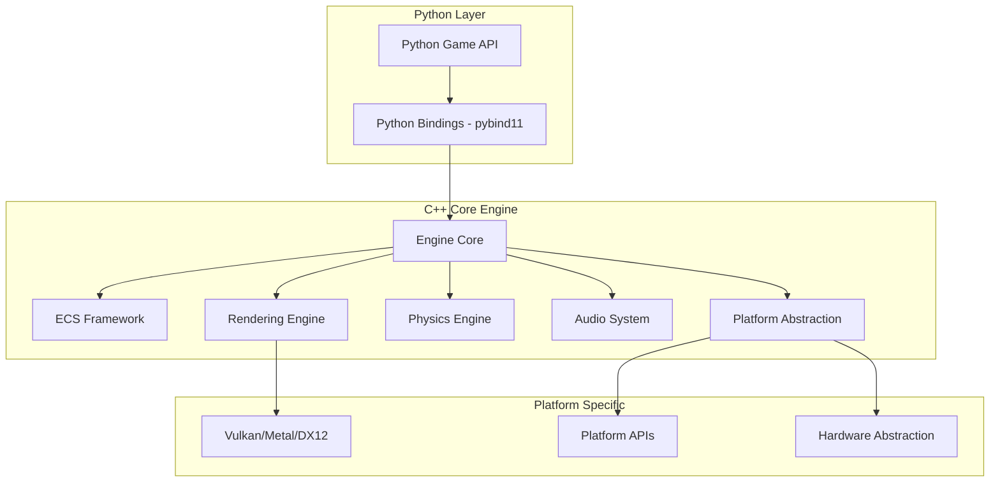

# Design Document: PyWRKGame 3.0.0

## Overview

PyWRKGame 3.0.0 представляет собой революционную игровую библиотеку, построенную на современной архитектуре C/C++ с Python биндингами для обеспечения максимальной производительности и простоты использования. Библиотека использует модульную архитектуру Entity-Component-System (ECS) для оптимальной производительности и гибкости, поддерживает современные графические API (Vulkan, Metal, DirectX 12) и предоставляет высокоуровневый Python API для быстрой разработки игр.

Ключевые принципы дизайна:
- **Производительность прежде всего**: C/C++ ядро с оптимизированными алгоритмами
- **Простота использования**: Высокоуровневый Python API с минимальным boilerplate кодом
- **Кроссплатформенность**: Единый код для всех платформ
- **Модульность**: Компонентная архитектура для гибкости и расширяемости
- **Современные технологии**: Использование последних достижений в области графики и производительности

## Architecture

### High-Level Architecture



### Core Architecture Principles

**1. Layered Architecture**
- **Python API Layer**: Высокоуровневый интерфейс для разработчиков
- **C++ Engine Core**: Высокопроизводительное ядро с оптимизированными алгоритмами
- **Platform Abstraction Layer**: Абстракция для кроссплатформенной поддержки
- **Hardware Interface Layer**: Прямое взаимодействие с аппаратным обеспечением

**2. Entity-Component-System (ECS) Architecture**
- **Entities**: Уникальные идентификаторы игровых объектов
- **Components**: Данные без логики (позиция, рендеринг, физика)
- **Systems**: Логика обработки компонентов (рендеринг, физика, ИИ)

**3. Data-Oriented Design**
- Компоненты хранятся в непрерывных массивах для оптимизации кэша
- Системы обрабатывают данные пакетами для максимальной производительности
- Минимизация указателей и виртуальных вызовов

## Components and Interfaces

### 1. Engine Core (C++)

**Core Engine Manager**
```cpp
class EngineCore {
public:
    bool Initialize(const EngineConfig& config);
    void Update(float deltaTime);
    void Render();
    void Shutdown();
    
    // ECS Management
    EntityManager& GetEntityManager();
    SystemManager& GetSystemManager();
    ComponentManager& GetComponentManager();
    
    // Subsystem Access
    RenderingEngine& GetRenderer();
    PhysicsEngine& GetPhysics();
    AudioSystem& GetAudio();
    NetworkManager& GetNetwork();
};
```

**ECS Framework**
```cpp
// Entity Management
class EntityManager {
public:
    EntityID CreateEntity();
    void DestroyEntity(EntityID entity);
    bool IsEntityValid(EntityID entity);
};

// Component Management with Memory Pools
template<typename T>
class ComponentArray {
private:
    std::vector<T> components;
    std::unordered_map<EntityID, size_t> entityToIndex;
    std::unordered_map<size_t, EntityID> indexToEntity;
};

// System Base Class
class System {
public:
    virtual void Update(float deltaTime) = 0;
    virtual void Initialize() = 0;
    virtual void Shutdown() = 0;
};
```

### 2. Rendering Engine

**Modern Graphics API Abstraction**
```cpp
class RenderingEngine {
public:
    // Initialization
    bool Initialize(GraphicsAPI api, const RenderConfig& config);
    
    // Rendering Pipeline
    void BeginFrame();
    void EndFrame();
    void Present();
    
    // Resource Management
    TextureHandle CreateTexture(const TextureDesc& desc);
    MeshHandle CreateMesh(const MeshData& data);
    ShaderHandle CreateShader(const ShaderDesc& desc);
    
    // Advanced Features
    void SetupPBRPipeline();
    void EnableGlobalIllumination(bool enable);
    void SetPostProcessingChain(const PostProcessChain& chain);
};

// Graphics API Abstraction
class GraphicsDevice {
public:
    virtual bool Initialize() = 0;
    virtual void CreateRenderPass() = 0;
    virtual void SubmitCommands() = 0;
    virtual void Present() = 0;
};

// Concrete implementations
class VulkanDevice : public GraphicsDevice { /* ... */ };
class MetalDevice : public GraphicsDevice { /* ... */ };
class D3D12Device : public GraphicsDevice { /* ... */ };
```

**PBR Rendering Pipeline**
```cpp
class PBRRenderer {
public:
    struct MaterialProperties {
        glm::vec3 albedo;
        float metallic;
        float roughness;
        float ao;
        TextureHandle albedoMap;
        TextureHandle normalMap;
        TextureHandle metallicRoughnessMap;
    };
    
    void RenderPBRMesh(const Mesh& mesh, const MaterialProperties& material);
    void SetupEnvironmentLighting(const HDRITexture& hdri);
    void EnableGlobalIllumination(GITechnique technique);
};
```

### 3. Physics Engine Integration

**Physics System Architecture**
```cpp
class PhysicsEngine {
public:
    bool Initialize(PhysicsBackend backend);
    void Update(float deltaTime);
    
    // Rigid Body Physics
    RigidBodyHandle CreateRigidBody(const RigidBodyDesc& desc);
    void SetRigidBodyTransform(RigidBodyHandle handle, const Transform& transform);
    
    // Soft Body Physics
    SoftBodyHandle CreateSoftBody(const SoftBodyDesc& desc);
    void UpdateSoftBodyMesh(SoftBodyHandle handle, MeshHandle mesh);
    
    // Collision Detection
    void SetCollisionCallback(CollisionCallback callback);
    bool RaycastQuery(const Ray& ray, RaycastResult& result);
};

// Physics Backend Abstraction
enum class PhysicsBackend {
    Bullet3,
    PhysX,
    Box2D,
    Custom
};
```

### 4. Audio System

**3D Audio Engine**
```cpp
class AudioSystem {
public:
    bool Initialize(const AudioConfig& config);
    
    // 3D Positional Audio
    AudioSourceHandle CreateAudioSource(const AudioClip& clip);
    void SetSourcePosition(AudioSourceHandle source, const glm::vec3& position);
    void SetListenerTransform(const Transform& transform);
    
    // Advanced Audio Features
    void EnableHRTF(bool enable);
    void SetReverbZone(const ReverbZoneDesc& desc);
    void SetAudioEffect(AudioSourceHandle source, AudioEffect effect);
    
    // Adaptive Music System
    void PlayAdaptiveMusic(const MusicTrack& track, GameState state);
    void CrossfadeMusic(const MusicTrack& newTrack, float duration);
};
```

### 5. Platform Abstraction Layer

**Cross-Platform Interface**
```cpp
class PlatformManager {
public:
    static PlatformType GetCurrentPlatform();
    static bool IsMobilePlatform();
    static bool SupportsVulkan();
    static bool SupportsRayTracing();
    
    // Mobile-Specific Features
    void EnableHapticFeedback(HapticPattern pattern);
    void SetBatteryOptimization(bool enable);
    TouchInputManager& GetTouchInput();
    SensorManager& GetSensors();
    
    // Console-Specific Features
    void SetControllerVibration(int controller, float intensity);
    bool IsControllerConnected(int controller);
};

// Touch Input System
class TouchInputManager {
public:
    void RegisterGestureCallback(GestureType type, GestureCallback callback);
    bool IsMultiTouchSupported();
    std::vector<TouchPoint> GetActiveTouches();
};
```

### 6. Python Bindings Architecture

**pybind11 Integration**
```cpp
// Main Python Module
PYBIND11_MODULE(pywrkgame, m) {
    m.doc() = "PyWRKGame 3.0.0 - High-Performance Game Engine";
    
    // Core Classes
    py::class_<EngineCore>(m, "Engine")
        .def(py::init<>())
        .def("initialize", &EngineCore::Initialize)
        .def("update", &EngineCore::Update)
        .def("render", &EngineCore::Render);
    
    // ECS Bindings
    py::class_<EntityManager>(m, "EntityManager")
        .def("create_entity", &EntityManager::CreateEntity)
        .def("destroy_entity", &EntityManager::DestroyEntity);
    
    // High-Level Game Objects
    py::class_<GameObject>(m, "GameObject")
        .def(py::init<>())
        .def("add_component", &GameObject::AddComponent)
        .def("get_component", &GameObject::GetComponent);
}

// High-Level Python Wrapper
class GameObject {
public:
    template<typename T>
    void AddComponent(const T& component) {
        engine->GetComponentManager().AddComponent<T>(entityID, component);
    }
    
    template<typename T>
    T* GetComponent() {
        return engine->GetComponentManager().GetComponent<T>(entityID);
    }
};
```

## Data Models

### Core Data Structures

**Entity-Component Data Layout**
```cpp
// Component Storage (Structure of Arrays)
template<typename T>
struct ComponentStorage {
    std::vector<T> components;           // Actual component data
    std::vector<EntityID> entities;     // Entity owners
    std::unordered_map<EntityID, size_t> entityToIndex;
    size_t size = 0;
};

// Transform Component
struct TransformComponent {
    glm::vec3 position{0.0f};
    glm::quat rotation{1.0f, 0.0f, 0.0f, 0.0f};
    glm::vec3 scale{1.0f};
    glm::mat4 worldMatrix{1.0f};
    bool isDirty = true;
};

// Render Component
struct RenderComponent {
    MeshHandle mesh;
    MaterialHandle material;
    bool visible = true;
    float lodBias = 1.0f;
    uint32_t renderLayer = 0;
};

// Physics Component
struct PhysicsComponent {
    RigidBodyHandle rigidBody;
    ColliderHandle collider;
    float mass = 1.0f;
    glm::vec3 velocity{0.0f};
    bool isKinematic = false;
};
```

**Asset Management System**
```cpp
// Asset Handle System
template<typename T>
class AssetHandle {
private:
    uint32_t id;
    uint32_t generation;
public:
    bool IsValid() const;
    T* Get() const;
};

// Asset Manager
class AssetManager {
public:
    template<typename T>
    AssetHandle<T> LoadAsset(const std::string& path);
    
    template<typename T>
    void UnloadAsset(AssetHandle<T> handle);
    
    void GarbageCollect();
    
private:
    std::unordered_map<std::string, std::unique_ptr<Asset>> assets;
    std::vector<uint32_t> freeSlots;
};
```

**Memory Management**
```cpp
// Custom Memory Allocators
class StackAllocator {
public:
    StackAllocator(size_t size);
    void* Allocate(size_t size, size_t alignment = 8);
    void Reset();
};

class PoolAllocator {
public:
    PoolAllocator(size_t objectSize, size_t poolSize);
    void* Allocate();
    void Deallocate(void* ptr);
};

// Memory Manager
class MemoryManager {
public:
    static void Initialize(size_t totalSize);
    static StackAllocator& GetFrameAllocator();
    static PoolAllocator& GetComponentAllocator();
    static void* AllocateAligned(size_t size, size_t alignment);
};
```

## Correctness Properties

*A property is a characteristic or behavior that should hold true across all valid executions of a system-essentially, a formal statement about what the system should do. Properties serve as the bridge between human-readable specifications and machine-verifiable correctness guarantees.*

Основываясь на анализе критериев приемки, определены следующие тестируемые свойства:

### Performance Properties

**Property 1: Frame Rate Maintenance**
*For any* game running on low-end Android devices, the Performance_Optimizer should maintain minimum 30 FPS for 2D games and minimum 20 FPS for 3D games
**Validates: Requirements 1.2, 1.3**

**Property 2: Memory Leak Prevention**
*For any* game session running for extended periods, memory usage should not continuously grow, indicating absence of memory leaks
**Validates: Requirements 1.4**

**Property 3: Adaptive Quality Scaling**
*For any* system with limited resources, the Performance_Optimizer should automatically reduce rendering quality to maintain performance
**Validates: Requirements 1.5**

### Rendering Properties

**Property 4: PBR Material Rendering**
*For any* 3D object with PBR materials, the Rendering_Engine should produce physically accurate lighting and shading
**Validates: Requirements 3.1**

**Property 5: Global Illumination Accuracy**
*For any* scene with indirect lighting, the global illumination system should produce realistic light bouncing effects
**Validates: Requirements 3.2**

**Property 6: Dynamic Shadow Casting**
*For any* 2D scene with light sources, dynamic shadows should be cast correctly by occluding objects
**Validates: Requirements 3.3**

**Property 7: Post-Processing Effects**
*For any* scene with enabled post-processing effects (bloom, HDR, SSAO, motion blur), each effect should render correctly without artifacts
**Validates: Requirements 3.4**

**Property 8: GPU Particle Performance**
*For any* particle system, particles should be processed on GPU with performance significantly better than CPU-based systems
**Validates: Requirements 3.5**

**Property 9: Procedural Texture Generation**
*For any* procedural texture parameters, generated textures should be mathematically correct and reproducible
**Validates: Requirements 3.6**

**Property 10: LOD Optimization**
*For any* 3D scene with LOD models, appropriate detail levels should be selected based on camera distance
**Validates: Requirements 3.7**

**Property 11: Rendering Pipeline Consistency**
*For any* scene rendered with different pipelines (forward, deferred, tiled), the visual output should be equivalent
**Validates: Requirements 3.8**

### Asset Management Properties

**Property 12: Automatic Asset Optimization**
*For any* loaded asset, automatic optimization and compression should be applied based on target platform
**Validates: Requirements 4.3, 11.1**

**Property 13: Hot-Reloading Consistency**
*For any* modified asset or code, hot-reloading should update the running game without requiring restart
**Validates: Requirements 4.6**

**Property 14: Asset Streaming**
*For any* large world, assets should stream in and out based on proximity without causing frame drops
**Validates: Requirements 11.2**

**Property 15: Dependency Resolution**
*For any* asset bundle with dependencies, all required assets should be loaded in correct order
**Validates: Requirements 11.3**

**Property 16: Format Support**
*For any* supported texture format (DDS, KTX, ASTC) or audio format (MP3, OGG, WAV, FLAC), files should load and render/play correctly
**Validates: Requirements 11.4, 7.5**

**Property 17: Asynchronous Loading**
*For any* asset loaded asynchronously, progress callbacks should be called correctly and loading should not block main thread
**Validates: Requirements 11.5**

**Property 18: Asset Versioning**
*For any* asset with version updates, hot-swapping should work correctly without restart
**Validates: Requirements 11.6**

**Property 19: Runtime Asset Generation**
*For any* procedural asset generated at runtime, creation should be successful and asset should be usable immediately
**Validates: Requirements 11.7**

### UI System Properties

**Property 20: Touch Input Recognition**
*For any* touch gesture (tap, swipe, pinch, rotate), the system should recognize and respond correctly
**Validates: Requirements 5.1, 12.1**

**Property 21: Drag-and-Drop Functionality**
*For any* inventory system or UI builder, drag-and-drop operations should work correctly across all supported touch interfaces
**Validates: Requirements 5.2**

**Property 22: Progress Bar Animation**
*For any* progress bar with custom styles, animations should play smoothly and reflect accurate progress values
**Validates: Requirements 5.3**

**Property 23: Responsive Layout Adaptation**
*For any* UI layout, elements should adapt correctly to different screen sizes and orientations
**Validates: Requirements 5.4**

**Property 24: Dialog System Branching**
*For any* dialog tree with branching conversations, navigation should follow correct logic paths
**Validates: Requirements 5.5**

**Property 25: Real-time Minimap Updates**
*For any* minimap component, updates should reflect game state changes in real-time
**Validates: Requirements 5.6**

**Property 26: Theme Consistency**
*For any* UI elements with applied themes, styling should be consistent across all components
**Validates: Requirements 5.7**

### Physics Properties

**Property 27: 2D Collision Detection**
*For any* 2D rigid bodies, collisions should be detected accurately and collision responses should be physically correct
**Validates: Requirements 6.1**

**Property 28: 3D Soft Body Dynamics**
*For any* 3D soft body, deformation and dynamics should behave realistically according to physics laws
**Validates: Requirements 6.2**

**Property 29: Fluid Simulation Realism**
*For any* fluid simulation, behavior should follow realistic fluid dynamics principles
**Validates: Requirements 6.3**

**Property 30: Skeletal Animation Constraints**
*For any* skeletal animation with bone constraints, movements should respect constraint limits
**Validates: Requirements 6.4**

**Property 31: Procedural Animation Generation**
*For any* procedural animation parameters, generated animations should be smooth and realistic
**Validates: Requirements 6.5**

**Property 32: IK Solver Accuracy**
*For any* IK chain setup, the solver should find valid solutions that satisfy end-effector constraints
**Validates: Requirements 6.6**

**Property 33: Cloth and Hair Simulation**
*For any* cloth or hair simulation, behavior should be realistic and respond correctly to forces
**Validates: Requirements 6.7**

### Audio Properties

**Property 34: 3D Positional Audio**
*For any* audio source in 3D space, positional audio should correctly reflect distance and direction with HRTF processing
**Validates: Requirements 7.1**

**Property 35: Real-time Audio Effects**
*For any* audio with applied effects (reverb, echo, distortion), processing should occur in real-time without latency
**Validates: Requirements 7.2**

**Property 36: Adaptive Music System**
*For any* game state change, adaptive music should transition appropriately to match the new context
**Validates: Requirements 7.3**

**Property 37: Audio Compression**
*For any* audio loaded on mobile devices, compression should be applied automatically for optimization
**Validates: Requirements 7.4**

**Property 38: Audio Streaming**
*For any* large audio file, streaming should work without loading entire file into memory
**Validates: Requirements 7.6**

### Network Properties

**Property 39: Real-time Multiplayer Communication**
*For any* multiplayer game session, real-time communication should work reliably between clients and server
**Validates: Requirements 8.1**

**Property 40: P2P Local Multiplayer**
*For any* local multiplayer session, peer-to-peer communication should establish and maintain connections correctly
**Validates: Requirements 8.2**

**Property 41: Lag Compensation**
*For any* network session with artificial lag, compensation algorithms should maintain smooth gameplay
**Validates: Requirements 8.3**

**Property 42: Skill-based Matchmaking**
*For any* matchmaking request, players should be matched with others of similar skill levels
**Validates: Requirements 8.4**

**Property 43: Network Data Compression**
*For any* network traffic, data should be compressed automatically to reduce bandwidth usage
**Validates: Requirements 8.5**

**Property 44: Anti-cheat Protection**
*For any* attempted cheating method, the system should detect and prevent or report the violation
**Validates: Requirements 8.6**

**Property 45: Cloud Save Synchronization**
*For any* game save data, synchronization across devices should work correctly without data loss
**Validates: Requirements 8.7**

### AI Properties

**Property 46: Behavior Tree Execution**
*For any* NPC with behavior trees, AI should execute behaviors correctly according to tree logic
**Validates: Requirements 9.1**

**Property 47: Pathfinding Accuracy**
*For any* pathfinding request using A*, NavMesh, or flow fields, optimal or near-optimal paths should be found
**Validates: Requirements 9.2**

**Property 48: Adaptive AI Learning**
*For any* AI with machine learning integration, behavior should adapt and improve based on experience
**Validates: Requirements 9.3**

**Property 49: Procedural Content Quality**
*For any* procedurally generated content (levels, quests, items), output should meet quality and playability standards
**Validates: Requirements 9.4**

**Property 50: Crowd Simulation Realism**
*For any* large group of NPCs, crowd behavior should appear realistic and avoid unrealistic clustering or movement
**Validates: Requirements 9.6**

**Property 51: Natural Language Processing**
*For any* natural language input to dialog systems, processing should produce contextually appropriate responses
**Validates: Requirements 9.7**

### Development Tools Properties

**Property 52: Performance Profiler Accuracy**
*For any* running game, the profiler should display accurate GPU/CPU metrics in real-time
**Validates: Requirements 10.1**

**Property 53: Memory Leak Detection**
*For any* game with memory leaks, the memory analyzer should correctly identify and report leak locations
**Validates: Requirements 10.3**

**Property 54: Asset Dependency Tracking**
*For any* loaded asset, dependency tracking should correctly identify all required dependencies
**Validates: Requirements 10.4**

**Property 55: Crash Reporting**
*For any* application crash, crash reports with accurate stack traces should be generated automatically
**Validates: Requirements 10.7**

### Mobile-Specific Properties

**Property 56: Sensor Integration**
*For any* device sensor (accelerometer, gyroscope, magnetometer), readings should accurately reflect device orientation and movement
**Validates: Requirements 12.2**

**Property 57: Haptic Feedback**
*For any* haptic feedback trigger, device should vibrate with appropriate pattern and intensity
**Validates: Requirements 12.3**

**Property 58: Battery-based Performance Scaling**
*For any* device with varying battery levels, performance scaling should adjust appropriately to preserve battery life
**Validates: Requirements 12.4**

**Property 59: Automatic Pause/Resume**
*For any* mobile app lifecycle event (incoming call, app switch), game should pause and resume correctly
**Validates: Requirements 12.5**

<function_calls>
<invoke name="prework">
<parameter name="featureName">pywrkgame-library

## Error Handling

### Error Handling Strategy

PyWRKGame 3.0.0 использует многоуровневую стратегию обработки ошибок для обеспечения стабильности и отказоустойчивости:

**1. C++ Core Error Handling**
```cpp
// Result Type for Error Handling
template<typename T, typename E = ErrorCode>
class Result {
public:
    bool IsSuccess() const;
    bool IsError() const;
    T& GetValue();
    E GetError() const;
    
private:
    std::variant<T, E> value;
};

// Error Categories
enum class ErrorCode {
    Success = 0,
    InitializationFailed,
    ResourceNotFound,
    OutOfMemory,
    GraphicsDriverError,
    NetworkError,
    PhysicsError,
    AudioError,
    PlatformError
};
```

**2. Python Exception Mapping**
```python
# Custom Exception Hierarchy
class PyWRKGameError(Exception):
    """Base exception for PyWRKGame"""
    pass

class InitializationError(PyWRKGameError):
    """Engine initialization failed"""
    pass

class ResourceError(PyWRKGameError):
    """Resource loading/management error"""
    pass

class RenderingError(PyWRKGameError):
    """Graphics rendering error"""
    pass

class PhysicsError(PyWRKGameError):
    """Physics simulation error"""
    pass
```

**3. Graceful Degradation**
- Автоматическое снижение качества графики при ошибках GPU
- Fallback на программный рендеринг при недоступности аппаратного ускорения
- Автоматическое переключение на альтернативные аудио драйверы
- Сохранение состояния игры при критических ошибках

**4. Logging and Diagnostics**
```cpp
// Logging System
class Logger {
public:
    enum Level { Debug, Info, Warning, Error, Critical };
    
    static void Log(Level level, const std::string& message);
    static void SetLogLevel(Level level);
    static void SetOutputFile(const std::string& filename);
    static void EnableConsoleOutput(bool enable);
};

// Performance Monitoring
class PerformanceMonitor {
public:
    void BeginFrame();
    void EndFrame();
    float GetAverageFrameTime();
    float GetAverageFrameRate();
    MemoryStats GetMemoryStats();
    GPUStats GetGPUStats();
};
```

**5. Recovery Mechanisms**
- Автоматическое восстановление после сбоев рендеринга
- Переинициализация подсистем при критических ошибках
- Сохранение и восстановление состояния игры
- Автоматическая отправка отчетов о сбоях

## Testing Strategy

### Comprehensive Testing Approach

PyWRKGame 3.0.0 использует комбинированный подход к тестированию, включающий как unit-тесты для конкретных примеров, так и property-based тесты для проверки универсальных свойств.

**1. Unit Testing Framework**
```cpp
// C++ Unit Tests using Google Test
class RenderingEngineTest : public ::testing::Test {
protected:
    void SetUp() override {
        engine = std::make_unique<RenderingEngine>();
        ASSERT_TRUE(engine->Initialize(GraphicsAPI::Vulkan, config));
    }
    
    void TearDown() override {
        engine->Shutdown();
    }
    
    std::unique_ptr<RenderingEngine> engine;
    RenderConfig config;
};

TEST_F(RenderingEngineTest, CreateTexture) {
    TextureDesc desc{};
    desc.width = 256;
    desc.height = 256;
    desc.format = TextureFormat::RGBA8;
    
    auto handle = engine->CreateTexture(desc);
    EXPECT_TRUE(handle.IsValid());
}
```

**2. Property-Based Testing**

Для property-based тестирования будет использоваться библиотека **Hypothesis** для Python и **RapidCheck** для C++.

**Конфигурация тестов:**
- Минимум 100 итераций на каждый property-тест
- Каждый тест помечается комментарием с ссылкой на свойство из дизайна
- Формат тега: **Feature: pywrkgame-library, Property {number}: {property_text}**

**Примеры Property-Based тестов:**

```python
# Python Property Tests using Hypothesis
from hypothesis import given, strategies as st
import pywrkgame as pwg

@given(st.integers(min_value=1, max_value=4096), 
       st.integers(min_value=1, max_value=4096))
def test_texture_creation_property(width, height):
    """
    Feature: pywrkgame-library, Property 16: Format Support
    For any supported texture format, files should load and render correctly
    """
    engine = pwg.Engine()
    engine.initialize()
    
    texture_desc = pwg.TextureDesc(width=width, height=height, format=pwg.TextureFormat.RGBA8)
    texture = engine.create_texture(texture_desc)
    
    assert texture.is_valid()
    assert texture.get_width() == width
    assert texture.get_height() == height

@given(st.lists(st.floats(min_value=-1000, max_value=1000), min_size=3, max_size=3))
def test_3d_audio_positioning(position):
    """
    Feature: pywrkgame-library, Property 34: 3D Positional Audio
    For any audio source in 3D space, positional audio should correctly reflect distance and direction
    """
    audio_system = pwg.AudioSystem()
    audio_system.initialize()
    
    source = audio_system.create_source("test_audio.wav")
    audio_system.set_source_position(source, position)
    
    # Verify position is set correctly
    actual_position = audio_system.get_source_position(source)
    assert abs(actual_position[0] - position[0]) < 0.001
    assert abs(actual_position[1] - position[1]) < 0.001
    assert abs(actual_position[2] - position[2]) < 0.001
```

```cpp
// C++ Property Tests using RapidCheck
#include <rapidcheck.h>

RC_GTEST_PROP(PhysicsEngineTest, CollisionDetectionProperty, ()) {
    /*
     * Feature: pywrkgame-library, Property 27: 2D Collision Detection
     * For any 2D rigid bodies, collisions should be detected accurately
     */
    auto pos1 = *rc::gen::container<glm::vec2>(rc::gen::inRange(-100.0f, 100.0f));
    auto pos2 = *rc::gen::container<glm::vec2>(rc::gen::inRange(-100.0f, 100.0f));
    auto size = *rc::gen::inRange(1.0f, 10.0f);
    
    PhysicsEngine physics;
    physics.Initialize(PhysicsBackend::Box2D);
    
    auto body1 = physics.CreateRigidBody({pos1, size, size});
    auto body2 = physics.CreateRigidBody({pos2, size, size});
    
    physics.Update(0.016f); // One frame
    
    float distance = glm::distance(pos1, pos2);
    bool shouldCollide = distance < (size * 2);
    bool actuallyColliding = physics.AreColliding(body1, body2);
    
    RC_ASSERT(shouldCollide == actuallyColliding);
}
```

**3. Integration Testing**
- Тестирование взаимодействия между подсистемами
- Тестирование на реальных устройствах и платформах
- Автоматизированные тесты производительности
- Тестирование совместимости с различными версиями драйверов

**4. Platform-Specific Testing**
- Автоматизированное тестирование на эмуляторах Android
- Тестирование на физических устройствах iOS
- Тестирование производительности на слабых устройствах
- Тестирование VR/AR функциональности

**5. Continuous Integration**
```yaml
# CI/CD Pipeline Configuration
name: PyWRKGame CI
on: [push, pull_request]

jobs:
  test:
    runs-on: ${{ matrix.os }}
    strategy:
      matrix:
        os: [ubuntu-latest, windows-latest, macos-latest]
        python-version: [3.8, 3.9, 3.10, 3.11]
    
    steps:
    - uses: actions/checkout@v3
    - name: Set up Python
      uses: actions/setup-python@v3
      with:
        python-version: ${{ matrix.python-version }}
    
    - name: Install dependencies
      run: |
        pip install -r requirements.txt
        pip install hypothesis pytest
    
    - name: Run unit tests
      run: pytest tests/unit/
    
    - name: Run property tests
      run: pytest tests/property/ --hypothesis-profile=ci
    
    - name: Run integration tests
      run: pytest tests/integration/
```

**6. Performance Testing**
- Бенчмарки производительности для каждой подсистемы
- Тестирование памяти и обнаружение утечек
- Профилирование GPU и CPU использования
- Тестирование на различных конфигурациях оборудования

**7. Test Coverage Requirements**
- Минимум 90% покрытие кода для критических компонентов
- 100% покрытие для публичного API
- Обязательное тестирование всех error paths
- Регулярное обновление тестов при изменении требований

Эта стратегия тестирования обеспечивает высокое качество и надежность PyWRKGame 3.0.0, гарантируя что все заявленные функции работают корректно на всех поддерживаемых платформах.